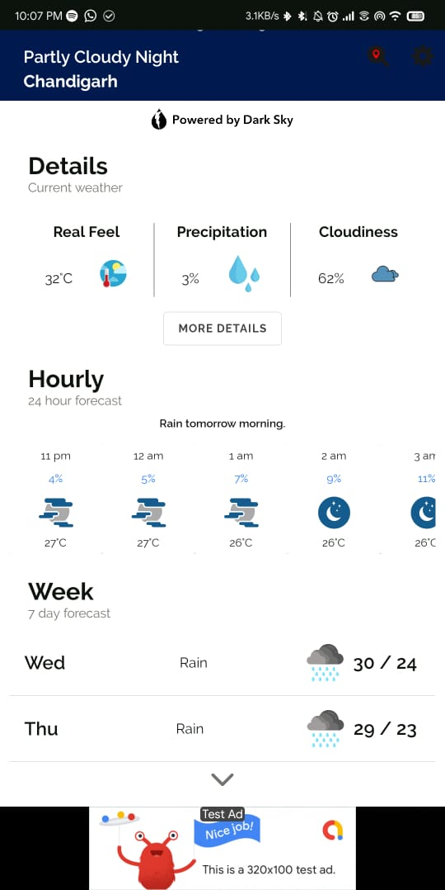

# Weatherly

Provides weather details and forecast based on current location. Search for differect cities using `Google Location API`. Get accurate weather details and forecast using `Dark Sky API`.

    

 

Custom weather based backgrounds

  
  .... and more!

Units and details according to your preference!

  
 
